# Quick MOT 

**Developer: Razvan Moruju**

💻 [Visit live website](https://quick-mot.herokuapp.com/)

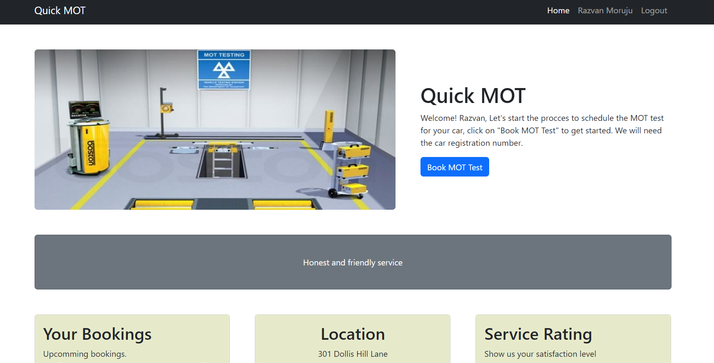

## Table of Contents
  - [About](#about)
  - [User Goals](#user-goals)
  - [Site Owner Goals](#site-owner-goals)
  - [User Experience](#user-experience)
  - [User Stories](#user-stories)
  - [Design](#design)
    - [Structure](#structure)
      - [Website pages](#website-pages)
      - [Database](#database)
  - [Technologies Used](#technologies-used)
  - [Features](#features)
  - [Validation](#validation)
  - [Testing](#testing)
    - [Manual testing of user stories](#manual-testing-of-user-stories)
    - [Performing tests on various devices](#performing-tests-on-various-devices)
    - [Browser compatibility](#browser-compatibility)
  - [Bugs](#bugs)
  - [Configuration](#configuration)
    - [Google emails](#google-emails)
    - [Forking the GitHub Repository](#forking-the-github-repository)
    - [Making a Local Clone](#making-a-local-clone)
  - [Credits](#credits)
  - [Acknowledgements](#acknowledgements)

  ### About

The Quick MOT is an application where users can book their car MOT test.

### User Goals

- Be able to book a MOT test
- Be able to amend MOT test date
- View the their upcoming MOT booking dates

### Site Owner Goals

- Provide an online solution for users to book a MOT test
- Create visually appealing design
- Provide fully responsive application with straightforward navigation

## User Experience

### Target Audience
- People who want to get their cars MOT test done
- People who want to book a MOT test in advance
- People who want to keep track of their upcoming MOT test 

### User Requirements and Expectations

- Straightforward navigation
- Easy to use
- A responsive application that allows the user to access it on any device
- Visually appealing design for all screen size
- Links and functions that work as expected
- Accessibility

##### Back to [top](#table-of-contents)

## User Stories

### Users

1.	I want to see the home page with explanation of the app
2.	I want to be able to easily navigate around the application to different pages
3.	I want to create my account to be able to book MOT tests
4.	I want to be able to edit my current booking date
5.	I want to delete my booking if no longer needed
6.	I want to see feedback messages so that I know that my booking was created, edited or deleted
7.	As a returning user, I want to log in to the app to see my current bookings
8.  I want to be able to log out from my account

### Site Owner
9.	I want only the logged-in users to be able to create a booking
10.	I want users to be able to create a booking on any day that suits their needs
11.	I want user to be able to rate our service
12.	I want my site to be fully responsive

##### Back to [top](#table-of-contents)

## Design

The application is based on a Bootstrap theme (Small Business)[https://startbootstrap.com/template/small-business]

### Structure

#### Website pages

Simplicity, clarity and ease of navigation between pages were the key aspects for design of this website's structure.

At the top of the page there is a recognisable type of navigation bar with website name on the left side and the navigation links to the right which collapses to hamburger icon on smaller screen sizes.

- The website consists of the following sections:
  - Home page with an overview of the content and aim of the website.
  - Add car reg number allowing user to enter a car registration number.
  - View car details where user can see details about the car and confirm if is the right car.
  - Add booking where users can select a booking data.
  - Edit booking where user cand change the booking date.
  - Login page for returning user to log in.
  - Register page allowing a new user to sign up.
  - Logout page allowing user to log out of the website.

#### Database

- The backend consists of Python built with the Django framework with a database of a Postgres for the deployed version

The following models were created to represent the database model structure for the website:

##### User Model
- The User model contains information about the user. It is part of the Django allauth library

##### Car Model
- The Car model contains various fields populated by the API with car information
- Contains 'booked' boolean field to check if the car is currently booked
- The model has a many to one relationship with User so User can have multiple cars

##### Booking Model
- The Booking model contains 'date' and 'create_on' fields
- Has ForeignKey for User and Car
- The model has a many to one relationship with User so User can have multiple bookings

##### Site Model
- A simple model designed to store average rating
- Can only be accessed from admin panel for one time creation

##### Rating Model
- Designed to store User rating for the Site

## Technologies Used

### Languages & Frameworks

- HTML
- CSS
- Javascript
- Python 3.10.9
- Django 3.2.16

### Libraries & Tools

- [Bootstrap](https://getbootstrap.com/). This project uses the Bootstrap library for UI components
- [Cloudinary](https://cloudinary.com/) to store static files
- [Favicon.io](https://favicon.io) for making the site favicon
- [Chrome dev tools](https://developers.google.com/web/tools/chrome-devtools/) was used for debugging of the code and checking site for responsiveness
- [Font Awesome](https://fontawesome.com/) - Icons from Font Awesome were used throughout the site
- [Git](https://git-scm.com/) was used for version control within VSCode to push the code to GitHub
- [GitHub](https://github.com/) was used as a remote repository to store project code
- [Heroku](https://www.heroku.com/) was used to deploy the project into live environment
- [ElephantSQL](https://www.elephantsql.com/) – to host a Postgres database
- [Visual Studio Code (VSCode)](https://code.visualstudio.com/) - code editor used to write this project
- Validation:
  - [WC3 Validator](https://validator.w3.org/) was used to validate the html in the project
  - [Jigsaw W3 Validator](https://jigsaw.w3.org/css-validator/) to validate the css in the project
  - [JShint](https://jshint.com/) for JavaScript quality
  - [Lighthouse](https://developers.google.com/web/tools/lighthouse/) for performance, accessibility, progressive web apps, SEO analysis of the project code
  - [Wave Validator](https://wave.webaim.org/) to evaluate accessibility

##### Back to [top](#table-of-contents)

## Features

### Logo and Navigation Bar
- Featured and consistent on the all pages
- The nav bar contains links to Home page, Login page or Logout page.
  - Logged-in users will see their name in the nav bar
  - Not logged in users will have option to log in and register
- The nav bar is fully responsive and changes to a toggler (hamburger menu) on smaller size screens
- User stories covered: 2, 12

See feature images

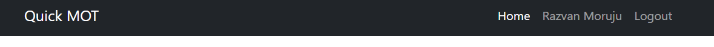
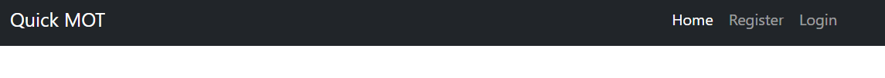
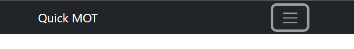
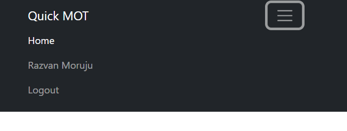

### Home page
- Home page includes nav bar, main body and a footer
- Home page Heading Row includes description of the website and what its users can find and expect.
- User stories covered: 1

See feature images

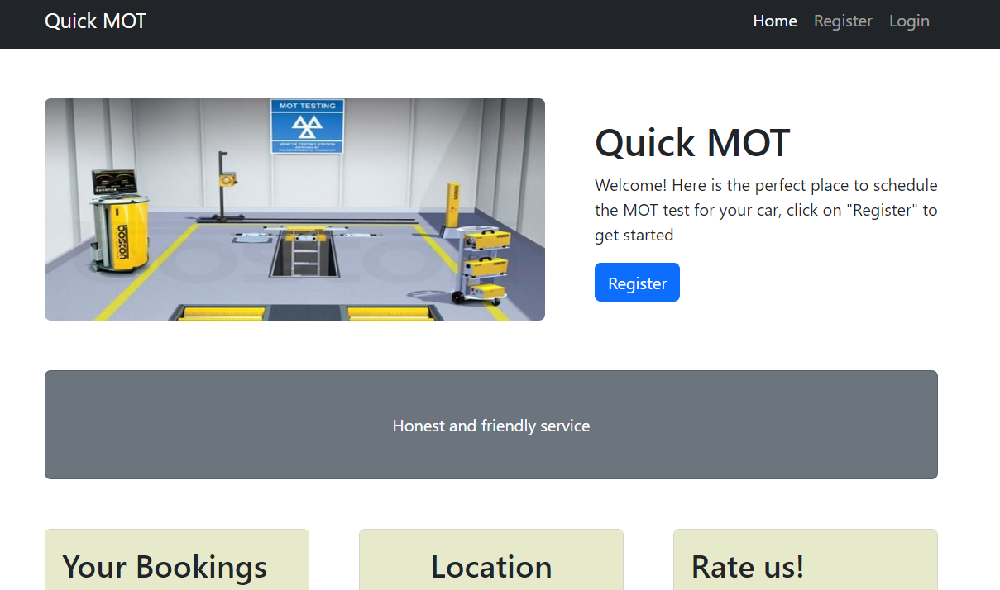

### Sign up / Register
- New users can create an account
- The user must provide a valid username, password and password confirmation. Email address is optional
- User cannot register the same details twice for an account
- Once register the users are immediately logged in and taken to the home page
- User stories covered: 3

See feature images

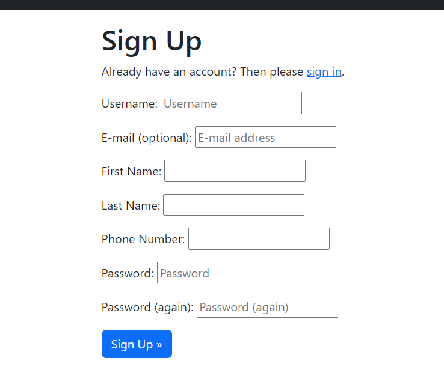

### Login
- Returning users can login to their account
- The user must have an account in the system and they must enter the correct username and password
- Both fields are mandatory
- Once logged in the user will be navigated to the home page
- User stories covered: 7, 10

See feature images

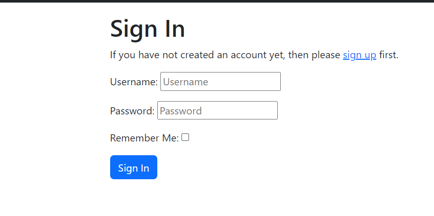

### Logout
- Confirmation screen for Logged in user to logout from their account 
- User stories covered: 8

See feature images

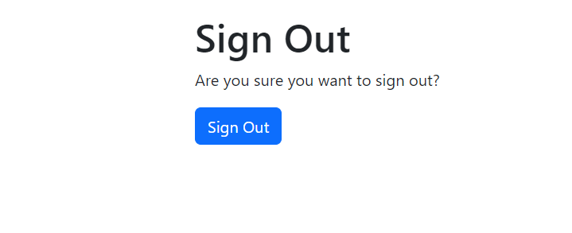

### Add car-reg/confirm-car/select-date
- Succession of screens where user can create a booking 
- User stories covered: 9, 10

See feature images

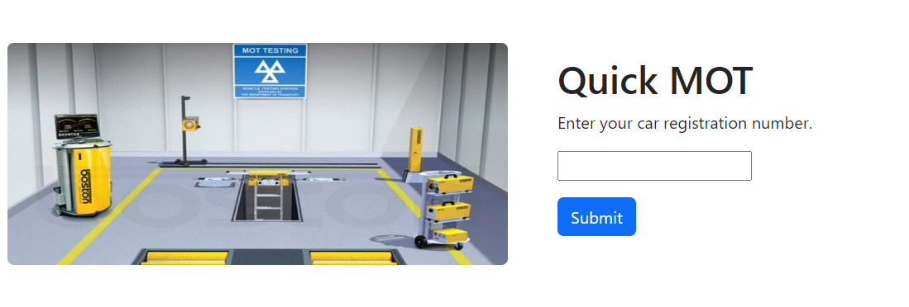
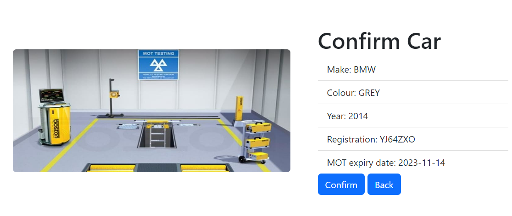
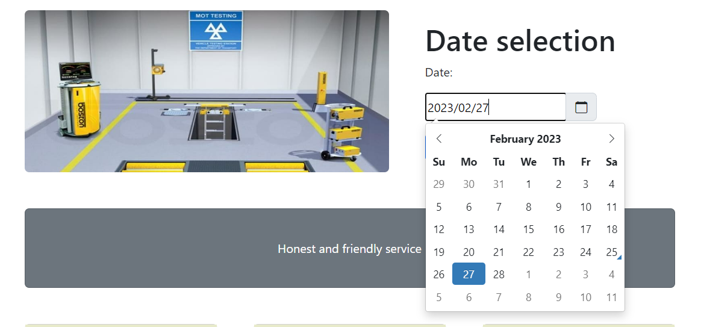

